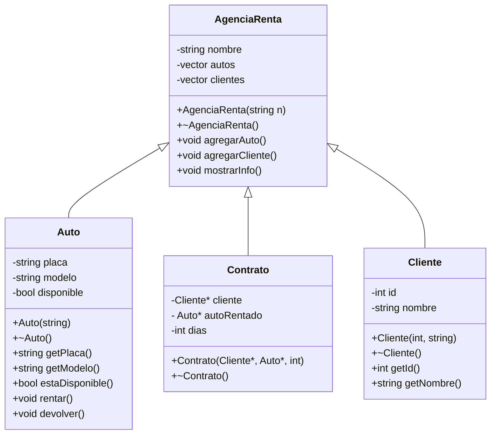

```mermaid
classDiagram
    class AgenciaRenta {
        -string nombre
        -vector <Auto*> autos 
        -vector <Cliente*> clientes
        +AgenciaRenta(string n)
        +~AgenciaRenta()
        +void agregarAuto()
        +void agregarCliente()
        +void mostrarInfo()
    }
    
    class Contrato {
        -Cliente* cliente
        - Auto* autoRentado
        -int dias
        +Contrato(Cliente*, Auto*, int)
        +~Contrato()
    }
    
    class Cliente {
        -int id
        -string nombre
        +Cliente(int, string)
        +~Cliente()
        +int getId()
        +string getNombre()
    }

class Auto {
        -string placa
        -string modelo
        -bool disponible
        +Auto(string)
        +~Auto()
        +string getPlaca()
        +string getModelo()
        +bool estaDisponible()
        +void rentar()
        +void devolver()
    }
    
    
    AgenciaRenta <|-- Auto
    AgenciaRenta <|-- Contrato
    AgenciaRenta <|-- Cliente
```
