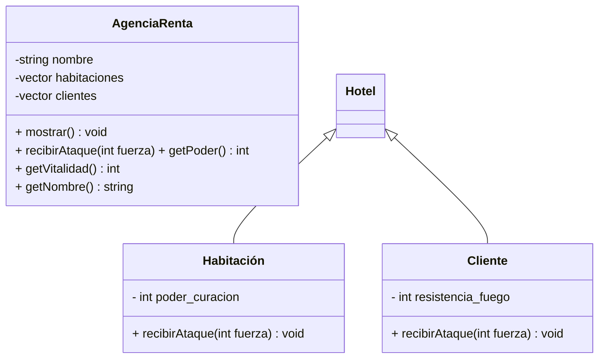

```mermaid
classDiagram
    class AgenciaRenta {
        -string nombre
        -vector <Habitación> habitaciones 
        -vector <Cliente*> clientes
        + mostrar() void
        + recibirAtaque(int fuerza)         + getPoder() int
        + getVitalidad() int
        + getNombre() string
    }
    
    class Cliente {
        - int resistencia_fuego
        + recibirAtaque(int fuerza) void
    }
    
    class Habitación {
        - int poder_curacion
        + recibirAtaque(int fuerza) void
    }
    
    Hotel <|-- Habitación
    Hotel <|-- Cliente
```
