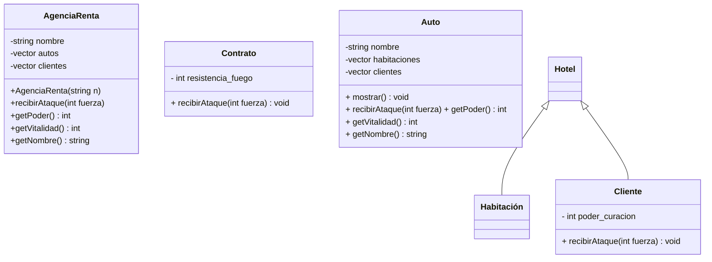

```mermaid
classDiagram
    class AgenciaRenta {
        -string nombre
        -vector <Auto*> autos 
        -vector <Cliente*> clientes
        +AgenciaRenta(string n)
        +recibirAtaque(int fuerza)
        +getPoder() int
        +getVitalidad() int
        +getNombre() string
    }
    
    class Contrato {
        - int resistencia_fuego
        + recibirAtaque(int fuerza) void
    }
    
    class Cliente {
        - int poder_curacion
        + recibirAtaque(int fuerza) void
    }

class Auto {
        -string nombre
        -vector <Habitación> habitaciones 
        -vector <Cliente*> clientes
        + mostrar() void
        + recibirAtaque(int fuerza)         + getPoder() int
        + getVitalidad() int
        + getNombre() string
    }
    
    
    Hotel <|-- Habitación
    Hotel <|-- Cliente
```
